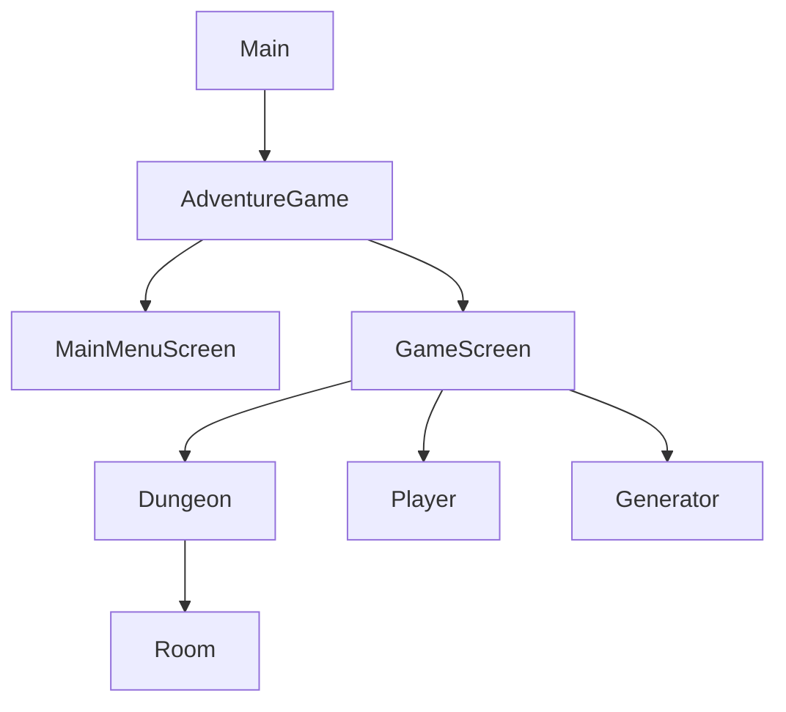

# Adventure Game

Ein textbasiertes Dungeon-Crawler Adventure-Spiel, entwickelt in Java mit LibGDX.

## Architektur



## Features

- Prozedural generierte Dungeons
- Grafische Benutzeroberfläche mit LibGDX (vorbereitet für 3D-Erweiterung)
- Hauptmenü mit Spielstand-Verwaltung
- Inventar-System
- Raum-Erkundung und Objekt-Interaktion
- Auto-Save Funktionalität (ein/ausschaltbar)
- Konfigurierbare Spieleinstellungen
- Umfassendes Logging-System

## Technologie-Stack

- **Java**: 21
- **Build Tool**: Maven 3.x
- **UI Framework**: LibGDX 1.12.1
- **Logging**: SLF4J + Logback
- **Testing**: JUnit 5 + Mockito

## Voraussetzungen

- Java 21 oder höher
- Maven 3.6 oder höher

## Build-Anleitung

### Projekt kompilieren

```bash
mvn clean compile
```

### Tests ausführen

```bash
mvn test
```

### JAR-Datei erstellen

```bash
mvn clean package
```

Die ausführbare JAR-Datei wird in `target/adventure-1.0-SNAPSHOT.jar` erstellt.

### Code Coverage Report generieren

```bash
mvn clean test jacoco:report
```

Der Coverage Report ist verfügbar unter `target/site/jacoco/index.html`

### Code Quality Check (Checkstyle)

```bash
mvn checkstyle:check
```

## Spiel starten

### Schnellstart (Empfohlen für Entwicklung)

```bash
mvn exec:java
```

Dieser Befehl kompiliert das Projekt automatisch und startet das Spiel direkt.

### Alternativ: Mit JAR-Datei

Erst das Projekt bauen:
```bash
mvn clean package
```

Dann das Spiel starten:
```bash
java -jar target/adventure-1.0-SNAPSHOT.jar
```

### Weitere Start-Optionen

Kompilieren und direkt starten:
```bash
mvn clean compile exec:java
```

## Hauptmenü

Beim Start erscheint das Hauptmenü mit folgenden Optionen:

| Option | Beschreibung |
|--------|--------------|
| Neues Spiel | Starte ein neues Spiel mit Spielername |
| Spiel laden | Lade einen gespeicherten Spielstand |
| Einstellungen | Autosave ein/ausschalten |
| Credits | Zeige Spielinformationen |
| Beenden | Spiel beenden |

**Navigation:** Pfeiltasten (↑↓) zum Auswählen, Enter zum Bestätigen, Esc zum Zurück

## Spielanleitung

### Verfügbare Befehle

| Befehl | Beschreibung | Beispiel |
|--------|--------------|----------|
| `gehe [richtung]` | Bewege dich in eine Richtung | `gehe nord` |
| `n/s/o/w` | Kurzform für Richtungen | `n` |
| `untersuche [objekt/raum]` | Untersuche einen Gegenstand oder Raum | `untersuche truhe` |
| `nimm [gegenstand]` | Nimm einen Gegenstand auf | `nimm schlüssel` |
| `inventar` | Zeige dein Inventar an | `inventar` |
| `benutze [gegenstand]` | Benutze einen Gegenstand aus dem Inventar | `benutze trank` |
| `speichern` | Spielstand manuell speichern | `speichern` |
| `menü` | Zurück zum Hauptmenü | `menü` |
| `hilfe` | Zeige die Hilfe an | `hilfe` |
| `exit` | Spiel speichern und beenden | `exit` |

### Richtungen

- **nord** (n) - Nach Norden gehen
- **süd** (s) - Nach Süden gehen
- **ost** (o) - Nach Osten gehen
- **west** (w) - Nach Westen gehen

### Tipps

- Untersuche jeden Raum gründlich mit `untersuche raum`
- Sammle Gegenstände, die du findest
- Das Spiel speichert automatisch alle 5 Minuten (wenn aktiviert)
- Verwende `exit` zum Beenden, um deinen Fortschritt zu speichern

## Konfiguration

Das Spiel kann über die Datei `src/main/resources/game.properties` konfiguriert werden:

```properties
# Dungeon-Größe
dungeon.width=13
dungeon.height=7

# Spieler-Einstellungen
player.name=Myrdn
player.start.x=3
player.start.y=3

# Auto-Save Einstellungen
autosave.enabled=true
autosave.interval.minutes=5

# Spiel-Einstellungen
game.max.command.length=80
```

## Projektstruktur

```
adventure/
├── src/
│   ├── main/
│   │   ├── java/
│   │   │   └── org/myrdn/adventure/
│   │   │       ├── config/         # Konfigurationsklassen
│   │   │       ├── datahandler/    # Datenmodelle und Persistenz
│   │   │       ├── gamecontroller/ # Spiellogik und Controller
│   │   │       ├── renderer/       # UI-Komponenten
│   │   │       └── screens/        # LibGDX Screens (Menu, Game)
│   │   └── resources/
│   │       ├── fonts/              # Schriftarten
│   │       ├── game.properties     # Spielkonfiguration
│   │       └── logback.xml         # Logging-Konfiguration
│   └── test/
│       └── java/                   # Unit Tests
├── pom.xml                         # Maven-Konfiguration
└── README.md
```

## Logs

Spiel-Logs werden in `logs/adventure.log` gespeichert. Die Logs enthalten:
- Spiel-Events
- Fehler und Exceptions
- Debug-Informationen
- Auto-Save Aktivitäten

## Entwicklung

### Code-Stil

Das Projekt verwendet Google Java Style Guide (über Checkstyle Plugin).

### Tests schreiben

Tests sollten in `src/test/java` platziert werden und JUnit 5 verwenden:

```java
@Test
void testPlayerMovement() {
    // Test implementation
}
```

### Debugging

Setze das Log-Level auf DEBUG in `logback.xml`:

```xml
<logger name="org.myrdn.adventure" level="DEBUG" />
```

## Lizenz

Dieses Projekt ist Open Source.

## Autor

Myrdn

## Beiträge

Beiträge sind willkommen! Bitte erstelle einen Pull Request oder öffne ein Issue.
