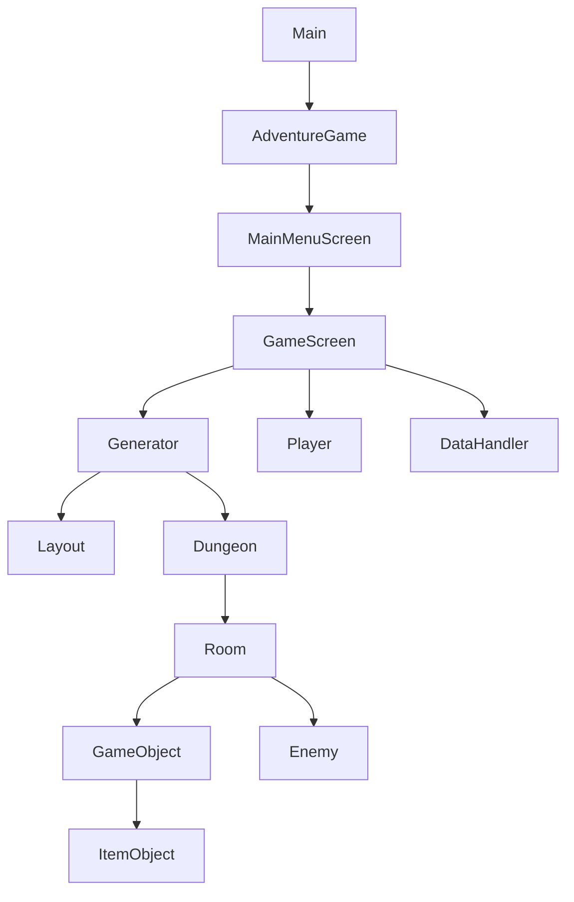

# Adventure Game

Ein textbasiertes Dungeon-Crawler Adventure-Spiel, entwickelt in Java mit LibGDX.

## Architektur


```mermaid
graph TD;
    Main-->AdventureGame;
    AdventureGame-->MainMenuScreen;
    MainMenuScreen-->GameScreen;
    GameScreen-->Generator;
    GameScreen-->Player;
    GameScreen-->DataHandler;
    Generator-->Layout;
    Generator-->Dungeon;
    Dungeon-->Room;
    Room-->GameObject;
    Room-->Enemy;
    GameObject-->ItemObject;
```

## Features

- Prozedural generierte, vollständig verbundene Dungeons (Tiefensuche)
- Terminal-Oberfläche mit LibGDX (120×40 Zeichen, Box-Drawing-Symbole)
- Hauptmenü mit Spielstand-Verwaltung (Laden/Neues Spiel)
- Inventar-System mit verwendbaren Gegenständen (Heilen, Angriff, Schaden, Fliehen)
- Raum-Erkundung und Objekt-Interaktion
- Rundenbasiertes Kampfsystem mit Flucht-Option
- Auto-Save Funktionalität (ein/ausschaltbar, alle 5 Minuten)
- Konfigurierbare Spieleinstellungen über `game.properties`
- Umfassendes Logging-System (SLF4J + Logback)
- CSV-basierte Spieldaten (60 Objekte, 40 Items, 11 Gegnertypen)

## Technologie-Stack

- **Java**: 21
- **Build Tool**: Maven 3.x
- **UI Framework**: LibGDX 1.12.1 (LWJGL3-Backend)
- **Font-Rendering**: LibGDX FreeType (JetBrainsMono-Regular.ttf)
- **Logging**: SLF4J 2.0.9 + Logback 1.4.11
- **Testing**: JUnit Jupiter 5.10.1 + Mockito 5.7.0
- **Code Quality**: Checkstyle (Google Java Style Guide), JaCoCo

## Voraussetzungen

- Java 21 oder höher
- Maven 3.6 oder höher

## Build-Anleitung

### Projekt kompilieren

```bash
mvn clean compile
```

### Tests ausführen

```bash
mvn test
```

### JAR-Datei erstellen

```bash
mvn clean package
```

Die ausführbare JAR-Datei wird in `target/adventure-1.0-SNAPSHOT.jar` erstellt. Abhängigkeiten werden in `target/lib/` abgelegt.

### Code Coverage Report generieren

```bash
mvn clean test jacoco:report
```

Der Coverage Report ist verfügbar unter `target/site/jacoco/index.html`

### Code Quality Check (Checkstyle)

```bash
mvn checkstyle:check
```

## Spiel starten

### Schnellstart (Empfohlen für Entwicklung)

```bash
mvn exec:java
```

### Alternativ: Mit JAR-Datei

```bash
mvn clean package
java -jar target/adventure-1.0-SNAPSHOT.jar
```

### Kompilieren und direkt starten

```bash
mvn clean compile exec:java
```

## Hauptmenü

Beim Start erscheint das Hauptmenü mit folgenden Optionen:

| Option | Beschreibung |
|--------|--------------|
| Neues Spiel | Spielername eingeben und neues Spiel starten |
| Spiel laden | Gespeicherten Spielstand laden (`.bin`-Dateien im Arbeitsverzeichnis) |
| Einstellungen | Autosave ein/ausschalten |
| Credits | Spielinformationen anzeigen |
| Beenden | Spiel beenden |

**Navigation:** `↑`/`↓` oder `W`/`S` zum Auswählen, `Enter` zum Bestätigen, `Esc` zum Zurück  
**Einstellungen ändern:** `Enter` oder `←`/`→`

## Spielanleitung

### Verfügbare Befehle

| Befehl | Beschreibung | Beispiel |
|--------|--------------|----------|
| `gehe [richtung]` | Bewege dich in eine Richtung | `gehe nord` |
| `n` / `s` / `o` / `w` | Kurzform für Richtungen | `n` |
| `untersuche raum` | Zeige alle Objekte im Raum | `untersuche raum` |
| `untersuche [objekt]` | Untersuche ein Objekt und zeige enthaltene Items | `untersuche truhe` |
| `nimm [gegenstand]` | Nimm ein Item aus dem zuletzt untersuchten Objekt auf | `nimm trank` |
| `inventar` | Zeige dein Inventar an | `inventar` |
| `benutze [gegenstand]` | Benutze einen Gegenstand aus dem Inventar | `benutze trank` |
| `angreifen` | Greife den Gegner im aktuellen Raum an | `angreifen` |
| `fliehen` | Versuche vor dem Gegner zu fliehen (50% Chance) | `fliehen` |
| `speichern` | Spielstand manuell speichern | `speichern` |
| `menü` | Spielstand speichern und zurück zum Hauptmenü | `menü` |
| `hilfe` | Zeige die Hilfe an | `hilfe` |
| `exit` | Spielstand speichern und Spiel beenden | `exit` |

### Richtungen

- **nord** (`n`) — Nach Norden gehen
- **süd** (`s`) — Nach Süden gehen
- **ost** (`o`) — Nach Osten gehen
- **west** (`w`) — Nach Westen gehen

### Kampfsystem

Betritt man einen Raum mit einem Gegner, kann man kämpfen oder fliehen:

- `angreifen` — Rundenbasierter Kampf: Spieler greift an, danach greift der Gegner zurück
- `fliehen` — 50% Chance zur erfolgreichen Flucht; bei Fehlschlag greift der Gegner an
- Items mit Effekttyp `DAMAGE` schaden dem Gegner direkt
- Items mit Effekttyp `FLEE` garantieren eine erfolgreiche Flucht

### Item-Effekte

| Effekttyp | Wirkung |
|-----------|---------|
| `HEAL` | Stellt HP wieder her |
| `ATTACK_BOOST` | Erhöht den Angriffswert dauerhaft |
| `DEFENSE_BOOST` | Erhöht die maximalen HP |
| `DAMAGE` | Verursacht Schaden an einem Gegner im Raum |
| `FLEE` | Garantierte Flucht aus dem aktuellen Raum |
| `NONE` | Zeigt die Item-Beschreibung an |

### Tipps

- Untersuche jeden Raum mit `untersuche raum`, um alle Objekte zu finden
- Untersuche dann einzelne Objekte, um darin versteckte Items zu entdecken
- Nimm Items erst auf, nachdem du das Objekt untersucht hast (`nimm [item]`)
- Das Spiel speichert beim Beenden (`exit`) und beim Zurück ins Menü (`menü`) automatisch
- Autosave sichert alle 5 Minuten (wenn aktiviert)

## Konfiguration

Das Spiel kann über `src/main/resources/game.properties` konfiguriert werden:

```properties
# Dungeon-Größe
dungeon.width=13
dungeon.height=7

# Spieler-Einstellungen
player.start.x=3
player.start.y=3

# Auto-Save Einstellungen
autosave.enabled=true
autosave.interval.minutes=5

# Fenster-Einstellungen
window.width=1200
window.height=720
window.resizable=false
window.vsync=true
window.fps=60

# Spiel-Einstellungen
game.max.command.length=80
```

## Projektstruktur

```
adventure/
├── src/
│   ├── main/
│   │   ├── java/
│   │   │   └── org/myrdn/adventure/
│   │   │       ├── config/             # GameConfig (lädt game.properties)
│   │   │       ├── datahandler/        # Datenmodelle (Player, Dungeon, Room, Enemy,
│   │   │       │                       #   GameObject, ItemObject, SaveGame)
│   │   │       │                       # Layout (Dungeon-Generierung per DFS)
│   │   │       │                       # DataHandler (CSV-Laden, Serialisierung)
│   │   │       ├── gamecontroller/     # Generator (Dungeon befüllen)
│   │   │       │                       # InputParser (Befehl parsen)
│   │   │       ├── renderer/           # BaseScreen, CommandLine, Map, PlayerStatus,
│   │   │       │                       #   TextBox, TextBoxList, RoomType, StyleCell
│   │   │       └── screens/            # MainMenuScreen, GameScreen
│   │   └── resources/
│   │       ├── csv/
│   │       │   ├── objects.csv         # 60 Raum-Objekte
│   │       │   ├── items.csv           # 40 Items mit Effekten
│   │       │   └── enemies.csv         # 11 Gegnertypen
│   │       ├── fonts/
│   │       │   └── JetBrainsMono-Regular.ttf
│   │       ├── game.properties         # Spielkonfiguration
│   │       └── logback.xml             # Logging-Konfiguration
│   └── test/
│       └── java/
│           └── org/myrdn/adventure/
│               ├── config/             # GameConfigTest (9 Tests)
│               ├── datahandler/        # PlayerTest (14 Tests)
│               └── gamecontroller/     # InputParserTest (6 Tests)
├── pom.xml
└── README.md
```

## Spielstände

Spielstände werden als `<Spielername>.bin` im Arbeitsverzeichnis gespeichert (Java-Serialisierung). Beim Laden werden alle `.bin`-Dateien im Arbeitsverzeichnis aufgelistet.

## Logs

Spiel-Logs werden in `logs/adventure.log` gespeichert (konfigurierbar in `logback.xml`).

## Entwicklung

### Code-Stil

Das Projekt verwendet den Google Java Style Guide (Checkstyle-Plugin mit `google_checks.xml`).

### Tests

Tests liegen in `src/test/java` und verwenden JUnit 5 + Mockito:

```bash
mvn test
```

### Debugging

Log-Level in `src/main/resources/logback.xml` auf DEBUG setzen:

```xml
<logger name="org.myrdn.adventure" level="DEBUG" />
```

## Lizenz

Dieses Projekt ist Open Source.

## Autor

Myrdn
